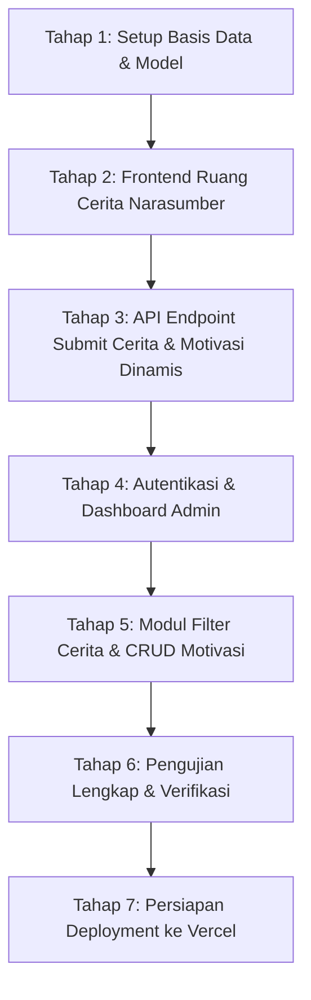

# Dokumen Spesifikasi Proyek: LESTARI - Jovian Health Care

Dokumen ini merangkum seluruh hasil diskusi dan kebutuhan sistem untuk platform **LESTARI - Ruang Cerita & Motivasi Jovian**. Platform ini dirancang sebagai media interaktif selama kegiatan sosialisasi kesehatan mental dan edukasi hidup sehat ke berbagai jenjang institusi pendidikan (SD, SMP, SMA, hingga Perguruan Tinggi/Mahasiswa).

---

## 1. Ringkasan & Tujuan Proyek

- **Nama Platform**: LESTARI (Edukasi & Aksi Nyata Hidup Sehat Bersama Jovian)
- **Fungsi Utama**: 
  - Memberikan ruang aman (*safe space*) bagi narasumber (peserta sosialisasi) untuk mencurahkan isi hati, beban pikiran, atau keluhan tanpa rasa dihakimi.
  - Memberikan umpan balik instan berupa pesan penguat hati dan kutipan motivasi yang dipersonalisasi.
  - Mencatat data demografi dan curahan hati ke database terpusat agar tim fasilitator Jovian dapat menganalisis isu-isu utama yang dihadapi para peserta di setiap jenjang pendidikan.
- **Rencana Rilis**:
  1. **Fase 1 (Fokus Saat Ini)**: Pembangunan sistem lokal (*local build*) lengkap berbasis Laravel 8 & MySQL di Laragon.
  2. **Fase 2 (Berikutnya)**: Persiapan konfigurasi dan *deployment* ke platform **Vercel**.

---

## 2. Arsitektur Teknologi

| Komponen | Spesifikasi & Pilihan Teknologi |
| :--- | :--- |
| **Backend Framework** | Laravel 8 (`v8.83.29`) |
| **Bahasa Pemrograman** | PHP `7.3+` / `8.x` |
| **Basis Data** | MySQL (`lestari-jovian`) |
| **Frontend Rendering** | Blade Template Engine + Vanilla JavaScript interaktif |
| **Desain & Gaya** | Palet Mewah Maroon & Gold, Glassmorphism, Responsive Mobile-First |
| **Tipografi** | *Playfair Display* (Heading/Serif) & *Poppins* (Body/Sans-serif) |
| **Efek Sensorik** | HTML5 Canvas Particle Engine & Web Audio API (Frekuensi Solfeggio 174 Hz) |
| **Target Deployment** | Vercel (akan disiapkan setelah fase build selesai) |

---

## 3. Spesifikasi Fitur

### 3.1. Sisi Narasumber / Peserta (Antarmuka Publik)

Mengadopsi alur dan estetika penuh dari referensi [lestari-app.netlify.app](https://lestari-app.netlify.app/):

1. **Halaman 1: Formulir Informasi Diri**
   - **Nama Lengkap / Panggilan**: Input teks nama narasumber.
   - **Umur (Tahun)**: Input numerik (rentang umur 5–120 tahun).
   - **Jenis Kelamin**: Pilihan radio interaktif (*Pria* / *Wanita*).
   - **Jenjang Pendidikan**: Dropdown pilihan (*SD / Sederajat*, *SMP / Sederajat*, *SMA / SMK / MA*, *MAHASISWA*, *UMUM / LAINNYA*).
   - Tombol **"Lanjutkan ke Ruang Cerita"** dengan validasi form yang mulus.

2. **Halaman 2: Ruang Cerita & Motivasi**
   - **Header Personal**: Menyapa peserta secara dinamis (`Halo, {Nama}!`) dan menampilkan lencana data diri yang telah diisi.
   - **Pilihan Fokus Cerita**:
     - *Diri Sendiri*
     - *Keluarga*
     - *Teman*
     - *Kekasih*
   - **Area Ungkapan Cerita**: Textarea untuk menuangkan keluhan/isi hati (maksimal 500 karakter dengan penghitung karakter *real-time*).
   - **Tombol "OPEN"**:
     - Tombol bundar berdenyut (*pulse glow animation*).
     - **Mekanisme Penyimpanan**: Begitu tombol **OPEN** diklik, profil narasumber dan isi ceritanya **otomatis tersimpan ke database MySQL**.
     - Mengirimkan respons pesan motivasi dan kutipan inspiratif yang cocok dengan kategori pilihan.
   - **Kartu Hasil Motivasi**:
     - Menampilkan pesan penguat hati dengan substitusi nama (`{NAMA}`).
     - Menampilkan kutipan kata bijak (*quote*).
     - Tombol aksi: **"Salin Pesan"** (ke clipboard) dan **"Simpan Catatan"** (ke riwayat catatan lokal di modal).
   - **Navigasi & Kontrol**:
     - Tombol **"Kembali & Edit Data"** dan **"Tulis Cerita Baru"**.
     - Tombol audio relaksasi di bilah atas (*Musik On/Off*).
     - Tombol **"Riwayat Cerita"** untuk membuka modal arsip catatan yang telah disimpan.

---

### 3.2. Sisi Fasilitator / Administrator (Dashboard Admin)

1. **Sistem Keamanan & Autentikasi**
   - Halaman login admin standar Laravel (`/admin/login` atau `/login`) dengan proteksi CSRF dan sesi aman.
   - Akun default administrator disiapkan via *Database Seeder*.

2. **Statistik & Visualisasi Data**
   - Kartu metrik utama: Total Cerita Masuk, Total Narasumber Hari Ini, Kategori Paling Sering Dipilih.
   - Grafik distribusi peserta berdasarkan jenjang pendidikan (SD, SMP, SMA, Mahasiswa).
   - Grafik sebaran kategori fokus curahan hati.

3. **Pencarian & Penyaringan Cerita (Filter & Search)**
   - Filter cepat berdasarkan:
     - Jenjang Pendidikan (SD / SMP / SMA / Mahasiswa / Umum).
     - Kategori Cerita (Diri Sendiri / Keluarga / Teman / Kekasih).
     - Rentang umur atau tanggal kegiatan sosialisasi.
   - Kolom pencarian teks berdasarkan nama narasumber atau kata kunci pada isi cerita.
   - Modal tampilan detail cerita lengkap beserta pesan motivasi yang diperoleh peserta.

4. **Manajemen Pesan Motivasi & Quotes (CRUD)**
   - Fasilitator dapat menambah, mengedit, atau menonaktifkan kalimat motivasi dan quote per kategori.
   - Mendukung tag `{NAMA}` agar teks yang muncul pada peserta tetap personal.
   - Memungkinkan variasi pesan motivasi yang beragam sehingga siswa tidak selalu mendapatkan pesan yang monoton.

---

## 4. Perancangan Basis Data (Database Schema)

### 4.1. Tabel `stories` (Curahan Hati Peserta)
| Kolom | Tipe Data | Keterangan |
| :--- | :--- | :--- |
| `id` | BIGINT (PK, Auto Increment) | ID unik data cerita |
| `nama` | VARCHAR(100) | Nama lengkap / panggilan narasumber |
| `umur` | INT | Umur narasumber |
| `jenis_kelamin` | ENUM('Pria', 'Wanita') | Jenis kelamin |
| `pendidikan` | ENUM('SD', 'SMP', 'SMA', 'MAHASISWA', 'UMUM') | Jenjang pendidikan |
| `kategori` | ENUM('Diri Sendiri', 'Keluarga', 'Teman', 'Kekasih') | Fokus kategori cerita |
| `cerita` | TEXT | Isi keluhan / curahan hati peserta |
| `motivation_text`| TEXT (Nullable) | Pesan motivasi yang ditampilkan |
| `quote_text` | TEXT (Nullable) | Kutipan penguat yang ditampilkan |
| `ip_address` | VARCHAR(45) (Nullable) | Alamat IP perangkat |
| `created_at` | TIMESTAMP | Waktu submit |
| `updated_at` | TIMESTAMP | Waktu pembaruan |

### 4.2. Tabel `motivations` (Bank Motivasi & Quotes)
| Kolom | Tipe Data | Keterangan |
| :--- | :--- | :--- |
| `id` | BIGINT (PK, Auto Increment) | ID unik pesan motivasi |
| `kategori` | VARCHAR(50) | 'Diri Sendiri', 'Keluarga', 'Teman', 'Kekasih' |
| `pesan` | TEXT | Pesan motivasi penguat hati (mendukung `{NAMA}`) |
| `quote` | TEXT | Kutipan kata bijak inspiratif |
| `is_active` | BOOLEAN (Default: true) | Status keaktifan pesan |
| `created_at` | TIMESTAMP | Waktu dibuat |
| `updated_at` | TIMESTAMP | Waktu diubah |

### 4.3. Tabel `users` (Administrator)
| Kolom | Tipe Data | Keterangan |
| :--- | :--- | :--- |
| `id` | BIGINT (PK, Auto Increment) | ID unik user |
| `name` | VARCHAR(255) | Nama akun fasilitator/admin |
| `email` | VARCHAR(255) (Unique) | Email login admin |
| `password` | VARCHAR(255) | Hash password |
| `created_at` | TIMESTAMP | Waktu dibuat |
| `updated_at` | TIMESTAMP | Waktu diubah |

---

## 5. Rencana Tahapan Eksekusi (Roadmap)

1. **Tahap 1: Persiapan Database & Model**
   - Konfigurasi koneksi MySQL `lestari-jovian`.
   - Membuat file migrasi untuk tabel `stories` dan `motivations`.
   - Membuat seeder awal akun admin dan bank pesan motivasi bawaan.
2. **Tahap 2 & 3: Antarmuka Narasumber & Integrasi API**
   - Membangun tampilan responsif Page 1 & Page 2 dengan gaya visual *Maroon & Gold*.
   - Mengintegrasikan partikel canvas dan audio relaksasi 174 Hz.
   - Menghubungkan tombol **OPEN** dengan endpoint penyimpanan cerita ke database dan pengambilan motivasi dinamis.
3. **Tahap 4 & 5: Dashboard Fasilitator / Admin**
   - Halaman login admin.
   - Halaman dashboard utama (grafik visual, ringkasan metrik).
   - Tabel interaktif daftar curahan hati narasumber (pencarian, penyaringan jenjang & kategori, modal baca cerita).
   - Halaman CRUD manajemen pesan motivasi dan quotes.
4. **Tahap 6 & 7: Pengujian & Kesiapan Vercel**
   - Menjalankan test unit/feature.
   - Menyiapkan struktur berkas yang kompatibel dengan Vercel (arsitektur serverless, penanganan aset statis, dan `vercel.json`) saat siap diluncurkan.
